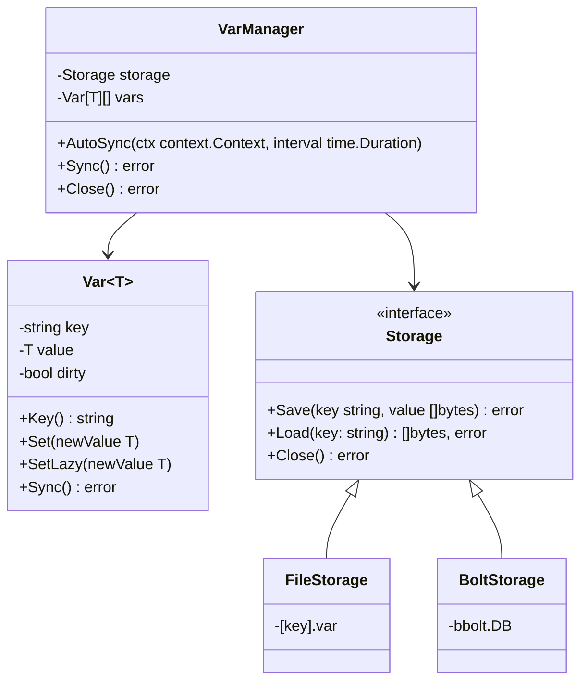

# PersistVar

Librería Go para **variables persistentes tipadas** con soporte genérico (`Var[T]`) y múltiples backends de almacenamiento.

Actualmente soporta:

* **FileStorage**: almacenamiento ligero, un archivo por variable.
* **BoltStorage**: almacenamiento embebido rápido, seguro para concurrencia y muchas variables.

---

## 📂 Estructura del proyecto

```
persistvar/
│
├── storage/                 
│   ├── filestorage.go       # Persistencia en archivos
│   └── boltstorage.go       # Persistencia con BoltDB
│
├── var.go                   # Implementación genérica de Var[T]
├── manager.go               # VarManager con AutoSync y Close()
├── storage.go               # Interface Storage { Save, Load, Close }
├── go.mod
└── README.md
```

---

## 📜 Ejemplo de uso

```go
package main

import (
    "context"
    "fmt"
    "github.com/eos175/persistvar"
    "github.com/eos175/persistvar/storage"
    "time"
)

func main() {
    // FileStorage
    fs, _ := storage.NewFileStorage("persistent")
    // BoltStorage
    // boltStorage, _ := storage.NewBoltStorage("vars.db")

    mgr := persistvar.NewVarManager(fs)
    defer mgr.Close() // Guarda cambios pendientes y cierra el manager al salir

    // Iniciar autosync cada 33 segundos
    ctx, cancel := context.WithCancel(context.Background())
    defer cancel()
    mgr.AutoSync(ctx, 33*time.Second)

    // Crear variables persistentes
    counter, _ := persistvar.NewVar(mgr, "counter", 0)
    username, _ := persistvar.NewVar(mgr, "username", "anon")

    // Modificar variables
    counter.SetLazy(counter.Get() + 1)
    username.SetLazy("Emmanuel")

    fmt.Println("Counter:", counter.Get())
    fmt.Println("Username:", username.Get())

    // Esperar para simular trabajo
    time.Sleep(10 * time.Second)
}
```

---

## ✅ Ventajas

* **Genéricos en Go** → `Var[T]` seguro en tiempo de compilación.
* **SetLazy()** y **Sync() global** → control total sobre cuándo se persisten los cambios.
* **AutoSync** → guarda automáticamente cambios lazy en background.
* **FileStorage** → ultra ligero para pocas variables.
* **BoltStorage** → rápido, concurrente y confiable para muchas variables.
* **Minimalista y sin dependencias innecesarias** (solo bbolt).

---

## ⚡ Recomendaciones de uso

1. Usa **FileStorage** para pocas variables simples.
2. Usa **BoltStorage** para muchas variables o cuando necesites concurrencia segura.
3. Siempre combina `AutoSync` con `defer mgr.Close()` para garantizar que todos los cambios pendientes se guarden al salir.

```go
ctx, cancel := context.WithCancel(context.Background())
mgr.AutoSync(ctx, 5*time.Second)
defer mgr.Close()   // commit final + cierre de recursos
defer cancel()     // detener autosync
```


## 🔹 Diagrama conceptual

