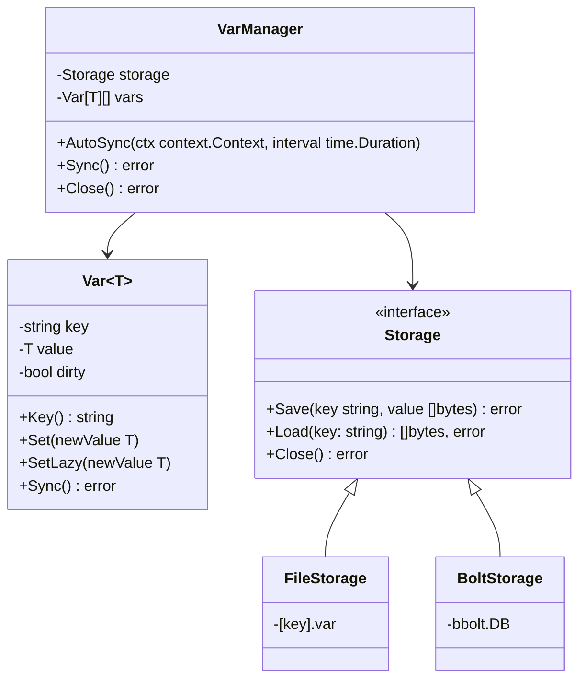

# PersistVar

Go library for **typed persistent variables** with generic support (`Var[T]`) and multiple storage backends.

Currently supports:

*   **FileStorage**: lightweight storage, one file per variable.
*   **BoltStorage**: fast embedded storage, safe for concurrency and many variables.

---

## 📂 Project Structure

```
persistvar/
│
├── storage/
│   ├── filestorage.go       # File-based persistence
│   └── boltstorage.go       # BoltDB-based persistence
│
├── var.go                   # Generic implementation of Var[T]
├── manager.go               # VarManager with AutoSync and Close()
├── storage.go               # Storage interface { Save, Load, Close }
├── go.mod
└── README.md
```

---

## 📜 Usage Example

```go
package main

import (
    "context"
    "fmt"
    "github.com/eos175/persistvar"
    "github.com/eos175/persistvar/storage"
    "time"
)

func main() {
    // FileStorage
    fs, _ := storage.NewFileStorage("persistent")
    // BoltStorage
    // boltStorage, _ := storage.NewBoltStorage("vars.db")

    mgr := persistvar.NewVarManager(fs)
    defer mgr.Close() // Saves pending changes and closes the manager on exit

    // Start autosync every 33 seconds
    ctx, cancel := context.WithCancel(context.Background())
    defer cancel()
    mgr.AutoSync(ctx, 33*time.Second)

    // Create persistent variables
    counter, _ := persistvar.NewVar(mgr, "counter", 0)
    username, _ := persistvar.NewVar(mgr, "username", "anon")

    // Modify variables
    counter.SetLazy(counter.Get() + 1)
    username.SetLazy("Emmanuel")

    fmt.Println("Counter:", counter.Get())
    fmt.Println("Username:", username.Get())

    // Wait to simulate work
    time.Sleep(10 * time.Second)
}
```

---

## ✅ Advantages

*   **Go Generics** → `Var[T]` is compile-time safe.
*   **SetLazy()** and **global Sync()** → full control over when changes are persisted.
*   **AutoSync** → automatically saves lazy changes in the background.
*   **FileStorage** → ultra-lightweight for a few variables.
*   **BoltStorage** → fast, concurrent, and reliable for many variables.
*   **Minimalist and without unnecessary dependencies** (only bbolt).

---

## ⚡ Usage Recommendations

1.  Use **FileStorage** for a few simple variables.
2.  Use **BoltStorage** for many variables or when you need safe concurrency.
3.  Always combine `AutoSync` with `defer mgr.Close()` to ensure all pending changes are saved on exit.

```go
ctx, cancel := context.WithCancel(context.Background())
mgr.AutoSync(ctx, 5*time.Second)
defer mgr.Close()   // final commit + resource cleanup
defer cancel()     // stop autosync
```

## 🔹 Conceptual Diagram

